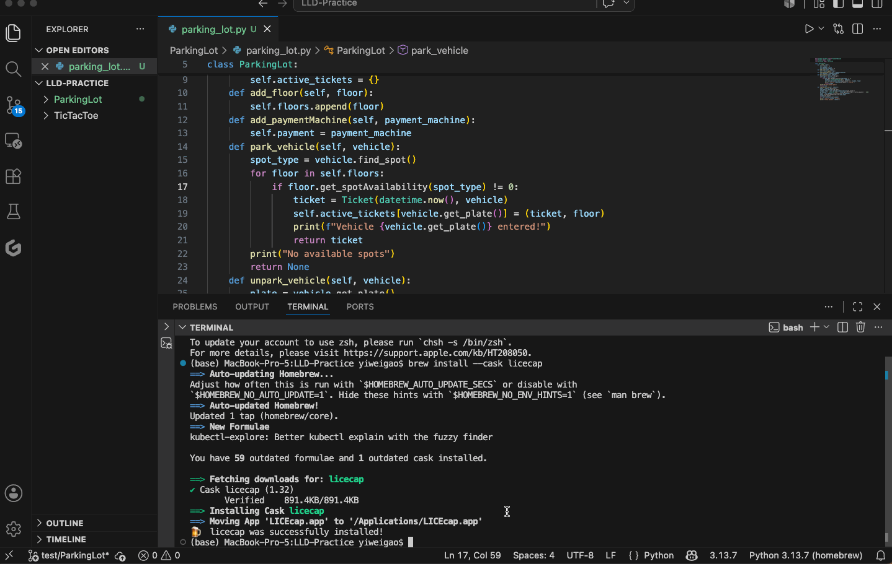
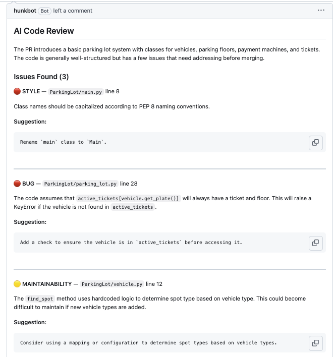

# Hunkbot 🤖

An AI-powered GitHub App that automatically reviews pull requests using GPT-4o. When a PR is opened or updated, Hunkbot analyzes the diff, identifies bugs, security issues, and maintainability problems, and posts a structured review comment directly on the PR.



**Live**: [hunkbot-production.up.railway.app/health](https://hunkbot-production.up.railway.app/health)

---

## What It Does

Hunkbot caught 3 real issues in a single PR review:



- 🔴 **BUG** — `active_tickets[vehicle.get_plate()]` will raise a `KeyError` if the vehicle is not found. Suggested adding a guard check before accessing the dict.
- 🔴 **STYLE** — Class `main` should be capitalized to `Main` per PEP 8.
- 🟡 **MAINTAINABILITY** — `find_spot()` uses hardcoded logic; suggested a mapping-based approach to support new vehicle types without modifying core logic.

---

## How It Works

```
GitHub PR opened / new commit pushed
            ↓
POST /github/webhook        ← HMAC-SHA256 signature verified
            ↓
diff_processor.py           ← filter lock files, truncate large diffs, infer language
            ↓
llm_reviewer.py             ← GPT-4o structured output → PRReviewResult (Pydantic-validated)
            ↓
github_service.py           ← GitHub App JWT auth → post review comment
```

1. GitHub sends a signed webhook event when a PR is opened or updated
2. The diff is filtered (lock files, build artifacts, deleted files removed) and truncated to stay within token limits
3. GPT-4o reviews the diff and returns a validated JSON response with severity, category, file, line, and fix suggestion for each issue
4. Hunkbot posts the structured review back to the PR

---

## Tech Stack

| Layer | Technology |
|-------|-----------|
| Web framework | FastAPI + Uvicorn |
| LLM | GPT-4o (OpenAI structured outputs) |
| GitHub integration | PyGithub + GitHub App JWT auth |
| Data validation | Pydantic v2 |
| Containerization | Docker |
| Deployment | Railway (auto-redeploy on push) |
| Language | Python 3.12 |

---

## Features

- **Structured reviews** — every comment includes severity (`error` / `warning` / `suggestion`), category (`bug` / `security` / `performance` / `style` / `maintainability`), file path, line number, and a concrete fix suggestion
- **Smart filtering** — skips lock files, build artifacts, auto-generated code, and deleted files
- **Token-aware** — truncates large diffs to stay within LLM context limits; configurable per-file line limit
- **Async processing** — webhook returns 200 immediately; review runs in background so GitHub never retries due to timeout
- **Secure** — HMAC-SHA256 webhook signature verification; GitHub App JWT authentication with short-lived installation tokens (no long-lived OAuth tokens)
- **Dockerized** — consistent environment across local dev and production; base64-encoded private key support for secret management in cloud environments

---

## Local Development

### Prerequisites
- Python 3.12
- Docker
- A GitHub App ([create one here](https://github.com/settings/apps/new))
- OpenAI API key

### Setup

```bash
# Clone and install
git clone https://github.com/yiweigao0226/Hunkbot.git
cd Hunkbot
python -m venv .venv
source .venv/bin/activate
pip install -r requirements.txt

# Configure
cp .env.example .env
# Fill in GITHUB_APP_ID, GITHUB_WEBHOOK_SECRET, OPENAI_API_KEY
# Place your GitHub App private key at ./private-key.pem

# Run locally
uvicorn app.main:app --reload --port 8000

# Expose to GitHub for local testing
ngrok http 8000
```

### Run with Docker

```bash
docker build -t hunkbot .
docker run -p 8080:8080 --env-file .env hunkbot
```

### Run Tests

```bash
pytest tests/ -v
```

---

## Project Structure

```
Hunkbot/
├── app/
│   ├── main.py                  # FastAPI app entry point
│   ├── api/
│   │   └── webhook.py           # POST /github/webhook
│   ├── core/
│   │   ├── config.py            # Settings (pydantic-settings)
│   │   └── models.py            # Pydantic models (PRReviewResult, ReviewComment)
│   └── services/
│       ├── diff_processor.py    # Parse, filter, and truncate PR diffs
│       ├── llm_reviewer.py      # GPT-4o structured output review
│       └── github_service.py    # GitHub App JWT auth + post review
└── tests/
    └── test_diff_processor.py   # Unit tests for diff processing logic
```

---

## Deployment

Hunkbot is containerized with Docker and deployed on Railway. Every push to `main` triggers an automatic redeploy.

The GitHub App private key is stored as a base64-encoded environment variable (`GITHUB_PRIVATE_KEY_BASE64`) for secure secret management in production.
