# Hunkbot 🤖

An AI-powered GitHub App that automatically reviews pull requests. When a PR is opened or updated, Hunkbot analyzes the diff, identifies bugs, security issues, and maintainability problems, and posts a structured review comment directly on the PR — with memory of past issues in the same repo.


**Live**: [hunkbot-production.up.railway.app/health](https://hunkbot-production.up.railway.app/health)

---

## What It Does

Hunkbot reviews every PR automatically and learns from past issues in the same repo:


After multiple PRs, Hunkbot surfaces recurring patterns:
- 🔴 **BUG** — `main` class should not have a method named `main`; confusing and can lead to errors.
- 🔴 **BUG** — `unpark_vehicle` assumes the vehicle is always parked; will raise a `KeyError`. **Recurring pattern: ERROR bug issues have appeared 13 time(s) in this repo.**
- 🟡 **PERFORMANCE** — `calculate_total` rounds up inefficiently. **Recurring pattern: WARNING performance issues have appeared 4 time(s) in this repo.**

---

## How It Works



1. GitHub sends a signed webhook event when a PR is opened or updated
2. The diff is filtered (lock files, build artifacts, deleted files removed) and truncated to stay within token limits
3. Historical bug patterns for the repo are queried from PostgreSQL and injected into the LLM prompt
4. The LLM reviews the diff and returns a validated JSON response with severity, category, file, line, and fix suggestion for each issue
5. Hunkbot posts the structured review back to the PR and persists the results to the database

---

## Tech Stack

| Layer | Technology |
|-------|-----------|
| Web framework | FastAPI + Uvicorn |
| LLM | GPT-4o / Claude — provider-agnostic interface |
| GitHub integration | PyGithub + GitHub App JWT auth |
| Data validation | Pydantic v2 |
| Database | PostgreSQL + SQLAlchemy async |
| Containerization | Docker |
| Deployment | Railway (auto-redeploy on push) |
| Language | Python 3.12 |

---

## Features

- **Retrieval-augmented review** — queries per-repo historical bug patterns from PostgreSQL and injects them into LLM context, enabling recurring issue detection across PRs
- **Provider-agnostic LLM interface** — supports OpenAI and Anthropic via a unified abstraction layer; switchable via `LLM_PROVIDER` environment variable
- **Structured reviews** — every comment includes severity (`error` / `warning` / `suggestion`), category (`bug` / `security` / `performance` / `style` / `maintainability`), file path, line number, and a concrete fix suggestion
- **Smart filtering** — skips lock files, build artifacts, auto-generated code, and deleted files
- **Token-aware** — truncates large diffs to stay within LLM context limits; configurable per-file line limit
- **Async processing** — webhook returns 200 immediately; review runs in background so GitHub never retries due to timeout
- **Secure** — HMAC-SHA256 webhook signature verification; GitHub App JWT authentication with short-lived installation tokens
- **Dockerized** — consistent environment across local dev and production; base64-encoded private key support for secret management in cloud environments

---

## Local Development

### Prerequisites
- Python 3.12
- Docker
- PostgreSQL (or use Railway's hosted instance)
- A GitHub App ([create one here](https://github.com/settings/apps/new))
- OpenAI or Anthropic API key

### Setup

```bash
# Clone and install
git clone https://github.com/yiweigao0226/Hunkbot.git
cd Hunkbot
python -m venv .venv
source .venv/bin/activate
pip install -r requirements.txt

# Configure
cp .env.example .env
# Fill in GITHUB_APP_ID, GITHUB_WEBHOOK_SECRET, OPENAI_API_KEY, DATABASE_URL
# Place your GitHub App private key at ./private-key.pem

# Run locally
uvicorn app.main:app --reload --port 8000

# Expose to GitHub for local testing
ngrok http 8000
```

### Run with Docker

```bash
docker build -t hunkbot .
docker run -p 8080:8080 --env-file .env hunkbot
```

### Switch LLM Provider

```bash
# Use Anthropic instead of OpenAI
LLM_PROVIDER=anthropic
ANTHROPIC_API_KEY=sk-ant-...
```

### Run Tests

```bash
pytest tests/ -v
```

---

## Project Structure

```
Hunkbot/
├── app/
│   ├── main.py                  # FastAPI app entry point
│   ├── api/
│   │   └── webhook.py           # POST /github/webhook
│   ├── core/
│   │   ├── config.py            # Settings (pydantic-settings)
│   │   ├── database.py          # SQLAlchemy async engine + session
│   │   ├── models.py            # Pydantic models (PRReviewResult, ReviewComment)
│   │   └── models_db.py         # SQLAlchemy ORM models (Review, ReviewComment)
│   └── services/
│       ├── diff_processor.py    # Parse, filter, and truncate PR diffs
│       ├── llm_providers.py     # Provider-agnostic LLM interface
│       ├── llm_reviewer.py      # Prompt builder + review orchestration
│       ├── review_store.py      # Persist and query review history
│       └── github_service.py    # GitHub App JWT auth + post review
└── tests/
    └── test_diff_processor.py   # Unit tests for diff processing logic
```

---

## Deployment

Hunkbot is containerized with Docker and deployed on Railway. Every push to `main` triggers an automatic redeploy.

The GitHub App private key is stored as a base64-encoded environment variable (`GITHUB_PRIVATE_KEY_BASE64`) for secure secret management in production.